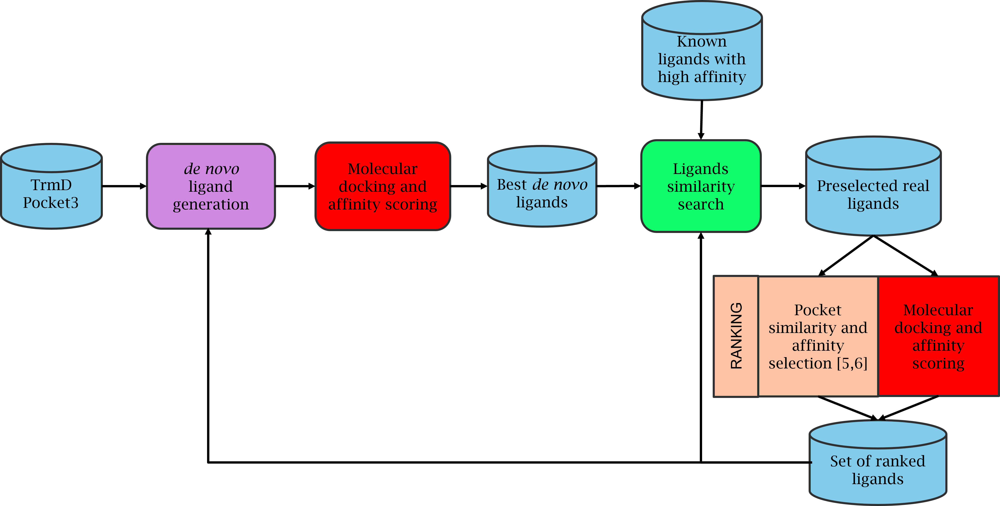

# MEET-EU Team 1 Pipeline for TrmD ligand drug screening

This directory contains the pipeline and data analysis for ligand discovery to target the bacteria's protein TrmD.

Authors: Bettiati Matteo, Boitel Léo, Hacquard Tristan, Jatiere Steve, Pautet Florence.

## Abstract:  

The bacterial tRNA methyl transferase has for several years been a target in drug discovery dueto its critical role in bacterial growth and absence in eukaryotes’ cells.  Several experimental andcomputational compound screening have been realized, to no concrete avail.  In the following re-port, we raise a concern regarding the selection of the compound being screened and the underusedpublic databases in recent publications.  Following this,  we outline here a pipeline with the goalof efficiently screen through such databases to quickly evaluate the druggability of small ligandmolecules.  We developed novel approaches leveraging cutting cutting-edge tools to select promis-ing ligands, evaluate their docking ability on TrmD and their potential in inhibiting it.

## Graphical Abstract:  

Organization of the folders respect to the graphical abstract:
- For the _de novo_ generation of ligands, refer to the folder ``.
- For ligand similarity search refer to `notebooks` and `scripts`.
- For ligand docking refer to `notebooks` and `scripts`.
- For pocket based ligand ranking to `Pocketgen` and `epocs`.
- For data and results analysis refer to `notebooks`.
- For the pipeline scripts refer to `pipeline` which contains the bash scripts pipelines for the docking and pocket based ligand ranking.
- The folder `transition` contains intermediary scripts necessary for the streamlining of the pipeline.

Detailed methods and results can be found in the file `MEET_U_report.pdf`.
